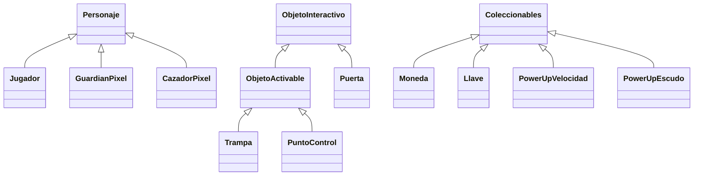

# 🎮 PIXEL ESCAPE

> Videojuego arcade de acción y aventura 2D con estética *pixel art*, inspirado en los videojuegos retro.

**Curso:** Programación Orientada a Objetos
**Institución:** Institución Universitaria Pascual Bravo
**Lenguaje:** C# (.NET Framework 4.7.2)

---

## 👥 Integrantes

- Samuel Suárez Jaramillo
- Salomé Garzón Flórez
- Daniela López Roldán

---

## 📖 Descripción del proyecto

El jugador controla a **Alex Pixel**, un personaje atrapado en un mundo de estilo pixel art. Para escapar debe recorrer distintos niveles, recoger objetos, superar obstáculos y evitar o enfrentar enemigos.

El juego comienza en el **Bosque Pixelado** y continúa en la **Fortaleza Oscura**, donde aumenta la dificultad y aparecen nuevas mecánicas.

### 🎯 Objetivo del proyecto

Diseñar e implementar un videojuego aplicando los principios de la **Programación Orientada a Objetos**: clases, objetos, atributos, comportamientos, encapsulamiento, herencia y polimorfismo.

### 🏁 Objetivo del juego

Superar los niveles y llegar a las salidas cumpliendo los objetivos de cada uno, usando correctamente el movimiento, los objetos y las habilidades del personaje.

### ✨ Características principales

- Personaje jugable con movimiento y salto
- Dos niveles diferenciados
- Diferentes tipos de enemigos
- Sistema de vidas y puntuación
- Monedas y objetos coleccionables
- Power-ups (velocidad y escudo)
- Obstáculos y trampas
- Llaves y puertas de salida

---

## 🗺️ Niveles

### Nivel 1 – Bosque Pixelado

Nivel introductorio a las mecánicas básicas. Dificultad moderada, pocos enemigos, obstáculos sencillos, espacios amplios y sin trampas complejas.

| | |
|---|---|
| **Objetivo** | Recoger 10 monedas y llegar a la puerta de salida |
| **Elementos** | Jugador, monedas, Guardián Pixel, obstáculos, power-up de velocidad, puerta de salida |
| **Victoria** | Recoger las 10 monedas y llegar a la puerta |
| **Derrota** | Perder las 3 vidas disponibles |

### Nivel 2 – Fortaleza Oscura

Caminos más estrechos, más enemigos, enemigos más rápidos y trampas. Introduce la mecánica de la **llave**.

| | |
|---|---|
| **Objetivo** | Encontrar la llave (protegida por enemigos) y usarla para abrir la puerta de salida |
| **Elementos** | Guardián Pixel, **Cazador Pixel**, trampas, monedas, power-up de escudo, llave, puerta de salida |
| **Victoria** | Conseguir la llave y llegar a la puerta de salida |
| **Derrota** | Perder las 3 vidas disponibles |

### Diferencias entre niveles

| Aspecto | Nivel 1 | Nivel 2 |
|---|---|---|
| Enfoque | Recoger monedas y evitar enemigos | Conseguir la llave y sobrevivir |
| Enemigos | Guardián Pixel | Guardián Pixel + Cazador Pixel |
| Trampas | No | Sí |
| Power-up | Velocidad | Escudo |
| Salida | Se abre al cumplir el objetivo | Requiere llave |

---

## 🧑‍🎤 Personajes

### Jugador – Alex Pixel
Personaje principal controlado por el usuario.
- Se mueve y salta
- Tiene 3 vidas
- Recoge objetos y usa power-ups
- Puede atacar a los enemigos

### Guardián Pixel (enemigo básico)
- Velocidad moderada
- Patrulla zonas específicas del escenario
- Al tocar al jugador, le quita una vida

### Cazador Pixel (exclusivo del Nivel 2)
- Mayor velocidad que el Guardián
- Detecta y persigue al jugador dentro de su rango de detección
- Al tocar al jugador, le quita una vida

---

## 🧩 Elementos del videojuego

| Elemento | Descripción y función |
|---|---|
| **Moneda** | Objeto coleccionable que aumenta el puntaje |
| **Power-up de velocidad** | Aumenta temporalmente la velocidad del jugador |
| **Power-up de escudo** | Protege al jugador de un impacto |
| **Llave** | Permite desbloquear la puerta de salida del Nivel 2 |
| **Puerta** | Salida del nivel; se abre al cumplir el objetivo correspondiente |
| **Trampa** | Causa daño al jugador al contacto |
| **Obstáculo** | Impide o limita el movimiento del jugador |
| **Punto de control** | Lugar al que regresa el jugador tras perder una vida |

---

## 🕹️ Mecánicas de juego

### Controles

| Tecla | Acción |
|---|---|
| `W` / `↑` | Saltar |
| `A` / `←` | Moverse a la izquierda |
| `D` / `→` | Moverse a la derecha |
| `Espacio` | Atacar |

### Sistema de vidas
El jugador comienza cada partida con **3 vidas**. Al recibir daño de un enemigo o una trampa pierde una vida y regresa al último punto de control.

### Sistema de puntuación
Se obtienen puntos al recoger monedas y derrotar enemigos, y puntos adicionales al completar un nivel.

### Condiciones generales
- **Victoria:** completar los objetivos de cada nivel y llegar a la salida.
- **Derrota:** perder las tres vidas disponibles.

### Interacciones

| Interacción | Resultado |
|---|---|
| Jugador + Moneda | La moneda desaparece y el jugador obtiene puntos |
| Jugador + Enemigo | Pierde una vida y regresa al punto de control |
| Jugador + Trampa | Pierde una vida y regresa al punto de control |
| Jugador + Power-up | Obtiene temporalmente el efecto correspondiente |
| Jugador + Llave | Recoge la llave y puede desbloquear la puerta |
| Jugador + Puerta | Si tiene la llave, la puerta se abre y completa el nivel |
| Jugador + Obstáculo | El obstáculo impide el paso; debe buscar otra ruta |
| Jugador + Punto de control | Se actualiza el lugar al que regresará tras perder una vida |

---

## 🏗️ Diseño orientado a objetos

### Atributos y comportamientos

| Clase | Atributos | Comportamientos |
|---|---|---|
| `Jugador` | Posición, vidas, puntaje, velocidad | Moverse, saltar, atacar, recoger objetos, usar power-ups |
| `GuardianPixel` | Posición, velocidad, daño, dirección | Moverse, patrullar, atacar |
| `CazadorPixel` | Posición, velocidad, daño, rango de detección | Moverse, detectar, perseguir, atacar |
| `Moneda` | Posición, valor | Ser recogida, aumentar el puntaje |
| `Power-up` | Posición, tipo, duración | Ser recogido, activar efecto |
| `Llave` | Posición, estado | Ser recogida, desbloquear la puerta |
| `Puerta` | Posición, estado | Bloquear, desbloquear, abrir |
| `Trampa` | Posición, daño, estado | Activarse, causar daño |
| `Obstaculo` | Posición, tamaño, tipo | Bloquear el movimiento |
| `PuntoControl` | Posición, estado | Guardar el progreso, establecer punto de regreso |

### Jerarquía de clases



---

## 📁 Estructura del repositorio

```
PixelEscape-master/
├── PixelEscape.sln
├── README.md
└── PixelEscape/
    ├── Program.cs            # Punto de entrada
    ├── Personaje.cs          # Clase base de personajes
    ├── Jugador.cs
    ├── GuardianPixel.cs
    ├── CazadorPixel.cs
    ├── ObjetoInteractivo.cs  # Clase base de objetos del escenario
    ├── ObjetoActivable.cs
    ├── Puerta.cs
    ├── Trampa.cs
    ├── PuntoControl.cs
    ├── Obstaculo.cs
    ├── Coleccionables.cs     # Base + power-ups de velocidad y escudo
    ├── Moneda.cs
    ├── Llave.cs
    └── Power_up.cs
```

---

## ⚙️ Requisitos y ejecución

**Requisitos**
- Windows con Visual Studio 2019 o superior
- Carga de trabajo *Desarrollo de escritorio con .NET*
- .NET Framework 4.7.2

**Pasos**
1. Clonar o descargar el repositorio.
2. Abrir `PixelEscape.sln` con Visual Studio.
3. Compilar la solución (`Ctrl + Shift + B`).
4. Ejecutar con `F5` o `Ctrl + F5`.

---

## 🚧 Estado del proyecto y próximos pasos

El proyecto se encuentra **en desarrollo**. Actualmente se están construyendo y probando las clases base desde consola (`Program.cs`).

- [x] Definición y descripción del videojuego
- [x] Diseño de clases y jerarquía
- [ ] Completar las clases de personajes y objetos
- [ ] Implementar la lógica de interacciones y colisiones
- [ ] Implementar el sistema de vidas, puntaje y puntos de control
- [ ] Construir el Nivel 1 – Bosque Pixelado
- [ ] Construir el Nivel 2 – Fortaleza Oscura
- [ ] Controles por teclado
- [ ] Pruebas finales

---

## 📄 Documentación

La definición y descripción completa del videojuego se encuentra en el documento *Definición y Descripción* entregado con el proyecto.
